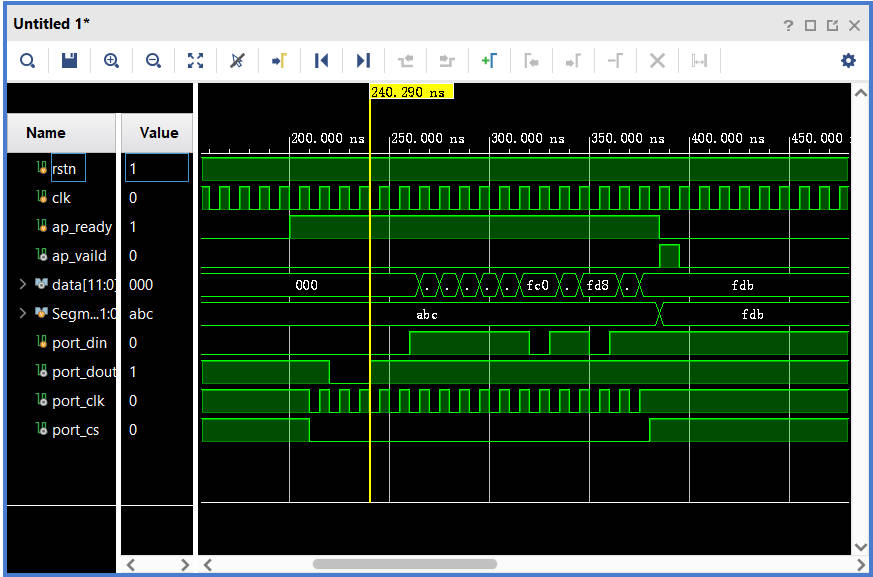

# MCP3202_SPI_FPGA
This is FPGA SPI ADC demo project for DSL, which using CMOD A7 as the development board. The MCP3202 Dual Channel FPGA was selected as ADC in this application which provide the demo Verilog Code to drive MCP3202

# Environement
* Vivado 2023.1;
* CMOD A7-35T;

# MCP3202 Operation Mode
* SINGLE_CHAN0  = 2'b10; - CHANNEL 0;
* SINGLE_CHAN1  = 2'b11; - CHANNEL 1;
* DIFFER_CHAN01 = 2'b00;  - DIFFERENTIAL CHANNEL 01
* DIFFER_CHAN10 = 2'b01;  - DIFFERENTIAL CHANNEL 10
 
# MCP3202 Protocol Detail:
* Inputs:
** - rstn: Active low reset signal.
** - clk: Clock signal.
** - ap_ready: Signal indicating the host is ready for data processing.
** - mode: 2-bit input to select the ADC channel and configuration.
** - port_din: Serial data input from the ADC.

* Outputs:
** - ap_vaild: Signal that indicates valid data is available.
** - data: 12-bit output holding the ADC conversion result.
** - port_dout: Serial data output to the ADC.
** - port_clk: Clock signal for the ADC.
** - port_cs: Chip select signal for the ADC, active low.

# MCP3202 Simulation Result
The following figure is the simulation result of MCP3202 SPI protocol.

# Reference
https://www.farnell.com/datasheets/1669376.pdf

